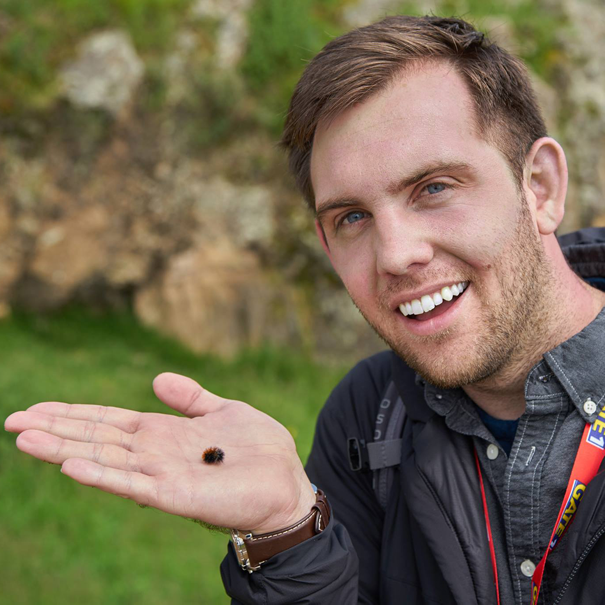

## Dr. Nicolas J. Dowdy

### [0000-0002-5453-2569](https://orcid.org/my-orcid?orcid=0000-0002-5453-2569)

#### Head of Zoology & Director of Collections Informations

#### [Milwaukee Public Museum](https://www.mpm.edu/zoology)

#### Assistant Research Professor, Department of Biology

#### [Wake Forest University](https://biology.wfu.edu/)

 

NOTE: I mostly use Gitlab for version control. See my gitlab here: [https://gitlab.com/njdowdy](https://gitlab.com/njdowdy)

### 👋 Hello, World! 👋

- 🔭 I’m currently working on studying the evolution of tiger moth anti-predator defenses
  - Click [here](#) for some ongoing projects!
- 🌱 I’m currently learning [tRPC](https://trpc.io/), [Next.js](https://nextjs.org/), [Prisma ORM](https://www.prisma.io/), [Figma](https://www.figma.com/)
- 👯 I’m looking to collaborate on lepidopteran evolution & taxonomic resource management
- 💬 Ask me about taxonomy, lepidoptera, evolution, phylogenetics, programming, data science, etc!
- 📫 How to reach me: njdowdy[at]gmail.com
- 📹 https://www.youtube.com/@arctiinae
- 😄 Pronouns: he/him
- ⚡ Fun fact: Lover of horror, board games, and good food 🍜!
- 🌎 I co-organize an annual international meeting of tiger moth researchers. Get in touch if you are interested in joining!

---

## Research Experience & Training

- 2022-current\.&emsp;Head of Zoology, Milwaukee Public Museum
- 2018-current\.&emsp;Assistant Research Professor, Wake Forest University
- 2018-2022\.&emsp;NSF Postdoctoral Research Fellowship in Biology ([DBI-1811897](https://www.nsf.gov/awardsearch/showAward?AWD_ID=1811897)), Milwaukee Public Museum
- 2020\.&emsp;Postdoctoral Researcher, Purdue University (Terrestrial Parasite Tracker TCN: [DBI-1901932](https://nsf.gov/awardsearch/showAward?AWD_ID=1901932))
- 2017-2018\.&emsp;Postdoctoral Researcher, Purdue University (PERC CSBR: [DBI-1561448](https://www.nsf.gov/awardsearch/showAward?AWD_ID=1561448))
- 2017\.&emsp;[Entomological Collections Management Workshop](https://ecnweb.net/workshop/)
- 2011-2017\.&emsp;Ph.D. Biology (PI: William E. Conner): Wake Forest University, Winston-Salem, NC, USA
- 2007-2011\.&emsp;B.S. Ecology & Evolutionary Biology, Minors: Mathematics, Chemistry: University of Arizona, Tucson, AZ, USA

---

## Publications

- <i>Accepted</i>&emsp;Chesshire, P.R., Fischer, E.E., <b style="color: orange;">Dowdy, N.J.</b>, Griswold, T.L., Hughes, A.C., Orr, M.C., Ascher, J.S., Guzman, L.M., Hung, K.J., Cobb N.S., McCabe, L.M. Completeness analysis for over 3000 United States bee species identifies persistent data gap. <i>Ecography</i>.
- 2022\.&emsp;Fernández Delgado, Y., <b style="color: orange;">Dowdy, N.J.</b>, Conner, W.E. High click rates generate the sonar-jamming strategy of tiger moths (Lepidoptera: Erebidae: Arctiinae). <i>Journal of Experimental Biology</i>. https://doi.org/10.1242/jeb.244187
- 2021\.&emsp;<b style="color: orange;">Dowdy, N.J.</b> TaxoTracker: A collaborative platform for taxonomic resource maintenance. <i>Biodiversity Information Science and Standards</i>. https://doi.org/10.3897/biss.5.73867
- 2020\.&emsp;<b style="color: orange;">Dowdy, N.J.</b>, Keating, S., Lemmon, A.R., Lemmon, E.M., Conner, W.E., Scott Chialvo, C.H., Weller, S.J., Simmons, R.B., Sisson, M.S., Zaspel, J.M. A deeper meaning for shallow‐level phylogenomic studies: nested anchored hybrid enrichment offers great promise for resolving the tiger moth tree of life (Lepidoptera: Erebidae: Arctiinae). <i>Systematic Entomology</i>. 45(4), p. 874-893. https://doi.org/10.1111/syen.12433
- 2020\.&emsp;Fernández, Y., <b style="color: orange;">Dowdy, N.J.</b>, Conner, W E. Extreme Duty Cycles in the Acoustic Signals of Tiger Moths: Sexual and Natural Selection Operating in Parallel. <i>Integrative Organismal Biology</i>. 2(1). https://doi.org/10.1093/iob/obaa046
- 2019\.&emsp;<b style="color: orange;">Dowdy, N.J.</b>, Conner, W.E. Nonchalant Flight in Tiger Moths (Erebidae: Arctiinae) Is Correlated With Unpalatability. <i>Frontiers in Ecology and Evolution</i>. 7. https://doi.org/10.3389/fevo.2019.00480
- 2019\.&emsp;Cobb, N.S., Gall, L.F., Zaspel, J.M., <b style="color: orange;">Dowdy, N.J.</b>, McCabe, L.M., Kawahara, A.Y. Assessment of North American arthropod collections: prospects and challenges for addressing biodiversity research. <i>PeerJ</i>. 7. e8086. http://doi.org/10.7717/peerj.8086
- 2019\.&emsp;<b style="color: orange;">Dowdy, N.J.</b>, Conner, W.E. Characteristics of tiger moth (Erebidae: Arctiinae) anti-bat sounds can be predicted from tymbal morphology. <i>Frontiers in Zoology</i>. 16(1). https://doi.org/10.1186/s12983-019-0345-6
- 2016\.&emsp;<b style="color: orange;">Dowdy, N.J.</b>, Conner, W.E. Acoustic Aposematism and Evasive Action in Select Chemically Defended Arctiine (Lepidoptera: Erebidae) Species: Nonchalant or Not?<i> PLoS ONE</i>. 11(4): e0152981. https://doi.org/10.1371/journal.pone.0152981
- 2014\.&emsp;Perlman, S., <b style="color: orange;">Dowdy, N.J.</b>, Harris, L.R., Khalid, M., Kelly, S.E., Hunter, M.S. Factors Affecting the Strength of <i>Cardinium</i>-Induced Cytoplasmic Incompatibility in the Parasitic Wasp <i>Encarsia pergandiella</i> (Hymenoptera: Aphelinidae). <i>Microbial Ecology</i>. 67(3): 671-678. https://doi.org/10.1007/s00248-013-0359-0

---

## Presentations

\* = presenter

- 2022\.&emsp;<b style="color: orange;">Dowdy, N.J.\*</b> Misunderstood "Monsters" – Bats and Moths.<i>North Carolina Museum of Natural Sciences' "Misunderstood Monsters" presentation series</i>. Virtual.
- 2022\.&emsp;<b style="color: orange;">Dowdy, N.J.\*</b>, Lemmon A.R., Lemmon E.M., Conner W.E., Zaspel J.M. Neotropical tiger moths (Erebidae: Arctiinae) have repeatedly evolved anti-bat sonar jamming. <i>Entomological Society of America</i>. Vancouver, British Columbia, Canada.
- 2022\.&emsp;<b style="color: orange;">Dowdy, N.J.\*</b>, Lemmon A.R., Lemmon E.M., Conner W.E., Zaspel J.M. Anti-bat sonar jamming has evolved repeatedly in the phaegopterine tiger moths (and beyond). <i>Arctiinae Research Community Meeting</i>. Virtual.
- 2022\.&emsp;Sullivan, K.\*, <b style="color: orange;">Dowdy, N.J.</b> Museomics, phylogenomics, and bioinformatics in resolving the tiger moth tree of life. <i>Arctiinae Research Community Meeting</i>. Virtual.
- 2021\.&emsp;<b style="color: orange;">Dowdy, N.J.\*</b> Aerial warfare between bats & moths. <i>Zoological Survey of India, Kolkata's "Unravelling the Moth Mysteries" presentation series</i>. Virtual.
- 2021\.&emsp;<b style="color: orange;">Dowdy, N.J.\*</b>, Fisher, M.L., Lemmon, A.R., Lemmon, E.R., Conner, W.E., Zaspel, J.M. Recent advances in the phylogenomics of the Arctiinae (Lepidoptera: Erebidae). <i>Arctiinae Research Community Meeting</i>. Virtual.
- 2021\.&emsp;Fernandez, Y.\*, <b style="color: orange;">Dowdy, N.J.</b>,Conner, W.E. Sexual and natural selection mold the acoustic signals of tiger moths in parallel. <i>Arctiinae Research Community Meeting</i>. Virtual.
- 2021\.&emsp;Barve, V., <b style="color: orange;">Dowdy, N.J.</b>, Mayfield-Meyer, T. Maintaining the taxonomic backbone (or connecting those who try). Symposium organizers and moderators. <i>Biodiversity Information Standards (TDWG)</i>. Virtual.
- 2021\.&emsp;<b style="color: orange;">Dowdy, N.J.\*</b> TaxoTracker: A collaborative platform for taxonomic resource maintenance. <i>Biodiversity Information Standards (TDWG)</i>. Virtual.
- 2020\.&emsp;Fisher, M.L.\*, <b style="color: orange;">Dowdy, N.J.</b>, Lemmon, A.R., Lemmon, E.M., Sweet, A., Cameron, S., Zaspel, J.M. Phylogenetic assessment of the lichen-feeding tiger moth subtribe Cisthenina (Erebidae: Arctiinae: Lithosiini) by combining anchored hybrid enrichment data with traditional loci. <i>Entomological Society of America</i>. Virtual.
- 2020\.&emsp;<b style="color: orange;">Dowdy, N.J.\*</b>, Fisher, M.L., Lemmon, A.R., Lemmon, E.M., Zaspel, J.M. The best of both worlds: Assessing the utility of the CO1 locus in the phylogenomic age. <i>Entomological Society of America</i>. Virtual.
- 2019\.&emsp;<b style="color: orange;">Dowdy, N.J.\*</b> The Distribution and Evolution of the Sonar-Jamming Anti-Bat Defense of Tiger Moths.<i> Boise State University's departmental seminar series</i>, Boise, ID, USA.
- 2018\.&emsp;<b style="color: orange;">Dowdy, N.J.\*</b>, Conner, W.E., Lemmon A.R., Lemmon, E.M., Zaspel, J.M. Behavioral and chemoecology on the pin: utilizing collections to transform our understanding of the bat-moth arms race. <i>International Society of Behavioural Ecology</i>. Minneapolis, MN, USA.
- 2018\.&emsp;Zaspel, J.M., Kawahara, A., McCabe, L., Cobb, N.S., <b style="color: orange;">Dowdy, N.J.\*</b> The Distribution, Size and Digitization Productivity of North American Entomology Collections.<i> Entomological Collections Network</i>. Vancouver, Canada.
- 2018\.&emsp;<b style="color: orange;">Dowdy, N.J.\*</b> Behavioral and Chemoecology on the Pin Utilizing Museum Collections to Better Understand the Bat-Moth Arms Race. <i>Lepidopterists' Society and Societas Europaea Lepidopterologica Joint Annual Meeting</i>. Ottawa, Ontario, Canada.
- 2018\.&emsp;<b style="color: orange;">Dowdy, N.J.\*</b> Behavioral And Chemoecology on the Pin: Utilizing Museum Collections to Better Understand the Bat-Moth Arms Race.<i> Purdue University's EcoLunch series</i>. West Lafayette, IN, USA.
- 2018\.&emsp;<b style="color: orange;">Dowdy, N.J.\*</b> Aerial warfare between bats & moths.<i> University of Wisconsin-Waukesha's EcoLunch series</i>. Waukesha, WI, USA.
- 2017\.&emsp;<b style="color: orange;">Dowdy, N.J.\*</b> Can characteristics of tiger moth (Erebidae: Arctiinae) anti-bat sounds be predicted from morphology? <i> Entomological Society of America</i>. Denver, CO, USA.
- 2017\.&emsp;<b style="color: orange;">Dowdy, N.J.\*</b> Co-option of sexual structures as novel anti-bat defenses among males of certain tiger moths (Lepidoptera: Erebidae: Arctiinae).<i> Entomological Collections Network</i>. Denver, CO, USA.
- 2017\.&emsp;<b style="color: orange;">Dowdy, N.J.\*</b> Aerial warfare between bats and moths.<i> Milwaukee Public Museum, Lunch and Lecture Series</i>. Denver, CO, USA.
- 2016\.&emsp;<b style="color: orange;">Dowdy, N.J.\*</b> Different Strokes for Different Folks? Can we distinguish sonar-jamming and acoustic aposematism in tiger moths (Lepidoptera: Erebidae: Arctiinae)?<i> International Congress of Entomology</i>. Orlando, FL, USA.
- 2015\.&emsp;<b style="color: orange;">Dowdy, N.J.\*</b> Acoustic Aposematism in Tiger Moths: Efficacy in the Field.<i> International Meeting on Invertebrate Sound & Vibration</i>. Ottawa, Ontario, Canada.

---

## Other Press

- 2022\.&emsp;MPM Press Release. Milwaukee Public Museum Hires Three Additional Scientific and Research Curators to Lead Botany, History and Anthropology, and Zoology Departments. Urban Milwaukee [LINK](https://urbanmilwaukee.com/pressrelease/milwaukee-public-museum-hires-three-additional-scientific-and-research-curators-to-lead-botany-history-and-anthropology-and-zoology-departments/)
- 2022\.&emsp;Knight, K. Fast-fire moths are better jammers, but bats can outsmart them. <i>Journal of Experimental Biology</i>. 225 (18): jeb244954. https://doi.org/10.1242/jeb.244954
- 2020\.&emsp;NSF News. Chemical defenses allow some moths to escape predatory bats. [LINK](https://beta.nsf.gov/news/chemical-defenses-allow-some-moths-escape)
- 2019\.&emsp;SciShow. Why These Moths Don't Run Away from Bats. https://www.youtube.com/watch?v=XznUaYRPptc
- 2019\.&emsp;Hasting, C. Lazy moths taste disgusting. Frontiers Science News. [LINK](https://blog.frontiersin.org/2019/12/16/lazy-moths-taste-disgusting/#:~:text=They%20hypothesized%20that%20nonchalant%20moths,their%20more%20delicious%20moth%20counterparts)
- 2019\.&emsp;PA News Agency. Lazy moths ‘taste disgusting so put less effort into evading predators’. Irvine Times. [LINK](https://www.irvinetimes.com/news/national-news/18103609.lazy-moths-taste-disgusting-put-less-effort-evading-predators/)
- 2019\.&emsp;Walawalkar, A. Bad taste in the moth: study reveals insect's chemical defence. The Guardian. [LINK](https://www.theguardian.com/environment/2019/dec/16/bad-taste-in-the-moth-study-reveals-insects-chemical-defence)
- 2019\.&emsp;Bard, S. Moths Flee or Face Bats, Depending on Toxicity. Scientific American. [LINK](https://www.scientificamerican.com/podcast/episode/moths-flee-or-face-bats-depending-on-toxicity/)
- 2019\.&emsp;Hayes, B. Bitter moths can't be bothered by hungry bats. United Press International. [LINK](https://www.upi.com/Science_News/2019/12/16/Bitter-moths-cant-be-bothered-by-hungry-bats/3551576473920/)
- 2019\.&emsp;Katz, B. Some Moths Taste So Bad That They Don’t Bother Fleeing From Bats. Smithsonian Magazine. [LINK](https://www.smithsonianmag.com/smart-news/some-moths-taste-so-bad-they-dont-bother-fleeing-bats-180973796/)
- 2017\.&emsp;PBS Deep Look. These Whispering, Walking Bats Are Onto Something. https://www.youtube.com/watch?v=l2py029bwhA
- 2016\.&emsp;Quirks and Quarks: Moths tell bats they taste nasty. [LINK](https://www.cbc.ca/radio/quirks/quirks-quarks-for-jun-4-2016-1.3615069/moths-tell-bats-they-taste-nasty-1.3615169)
- 2016\.&emsp;Davis. B. Tiger moths use signals to warn bats: toxic not tasty. Wake Forest News. [LINK](https://news.wfu.edu/2016/05/10/tiger-moths-use-signals-to-warn-bats-toxic-not-tasty/)
- 2016\.&emsp;2 New Things. Moth Fends Off Bats With Surprising Puff Of Sticky, White Fluff. [LINK](https://2newthings.com/moth-fends-off-bats-with-surprising-puff-of-sticky-white-fluff/)
- 2016\.&emsp;Interviewed for "Nature's Weirdest Events", BBC Two. Miami, FL, USA.
- 2016\.&emsp;Gough, Z. This new moth has an explosive way of fending off bats. BBC Earth. [LINK (broken)](http://www.bbc.com/earth/story/20160415-this-moth-has-an-explosive-way-of-fending-off-bats)
- 2016\.&emsp;Research & Filming Consultant. BBC. "Skyworlds".
- 2012\.&emsp;Research & Filming Consultant. National Geographic. Untamed Americas, Season 1, Episode 2: Deserts. [CLIP](https://www.youtube.com/watch?v=GZxK_0OSoFk)

---

## Funding, Awards, & Grant Support ($USD)

- 2022\.&emsp;Securing and Digitizing the Fluid-Stored Zoology Collections at the Milwaukee Public Museum -- <i>Pending</i>
- 2022\.&emsp;Top Cited Article 2020-2021 in <i>Systematic Entomology</i> [LINK](https://resjournals.onlinelibrary.wiley.com/doi/10.1111/syen.12433)
- 2021\.&emsp;NSF Postdoctoral Research Fellowship in Biology Supplement (DBI 1811897) -- $69,000
- 2018\.&emsp;John J. Brander and Christine E. Rundblad Research Fellowship -- $10,000
- 2018\.&emsp;NSF Postdoctoral Research Fellowship in Biology (DBI 1811897) -- $138,000
- 2017\.&emsp;ESA Student Competition for the President’s Prize in the Lepidoptera Section -- $186
- 2017\.&emsp;Grady Britt Award -- $2,500
- 2017\.&emsp;Elton C. Cocke Outstanding Graduate Student Award -- $500
- 2017\.&emsp;Entomological Collections Network Travel Grant -- $1,000
- 2015\.&emsp;Company of Biologist’s Award -- $500
- 2013\.&emsp;Theodore Roosevelt Research Grant, American Museum of Natural History -- $2,000
- 2013\.&emsp;Wake Forest University Vecellio Travel Grant -- $950
- 2013\.&emsp;Workshop in Next-Generation Sequencing Student Travel Award -- $200

---

## Broader Impacts & Public Engagement

- 2022\.&emsp;Zoology Team Lead, Milwaukee Public Museum 7th Annual BioBlitz, Pringle Nature Center, WI, USA
- 2021\.&emsp;Consultant. American Museum of Natural History. Extinct and Endangered: Insects in Peril Exhibit. [LINK](https://www.youtube.com/watch?v=GAB3vrYx5iU)
- 2021\.&emsp;Zoology Team Lead, Milwaukee Public Museum 6th Annual BioBlitz, Wehr Nature Center, WI, USA
- 2020\.&emsp;MPM Breakfast with the Curators 2020. [LINK](https://youtu.be/aNIyovU2NTE)
- 2019\.&emsp;The many ways species interact in the rainforest. Milwaukee Public Museum Exhibit.
- 2019\.&emsp;Lepidopterist, Milwaukee Public Museum 5th Annual BioBlitz, Riveredge Nature Center, WI, USA
- 2018\.&emsp;Lepidopterist, Milwaukee Public Museum 4th Annual BioBlitz, Lake Farm County Park, WI, USA
- 2017\.&emsp;Lepidopterist, Milwaukee Public Museum 3rd Annual BioBlitz, Fox River Park, WI, USA
- 2016\.&emsp;Lead Presenter & Guide, Moth Week, Prairie Ridge Ecostation, Raleigh, NC, USA
- 2015\.&emsp;Lead Presenter & Guide, Moth Week, Prairie Ridge Ecostation, Raleigh, NC, USA
- 2014\.&emsp;Lead Presenter & Guide, Moth Week, Prairie Ridge Ecostation, Raleigh, NC, USA
- 2013\.&emsp;Lead Presenter & Guide, Moth Week, Prairie Ridge Ecostation, Raleigh, NC, USA
- 2012\.&emsp;BugFest Booth: BUGS VS. BATS!, North Carolina Natural Science Museum, Raleigh, NC, USA

---

## What I'm Working On

- Neotropical tiger moths (Erebidae: Arctiinae) have repeatedly evolved anti-bat sonar jamming
- Phylogenomics resolves the biogeographic history of the rogue genus, <i>Xenosoma</i>
- Building a community-based taxonomic resource for digitization of parasites and their hosts
- Mistaken identities and lost species, resolving some taxonomic problems in the genus <i>Hypercompe</i> Hübner
- Phylogenomics resolves long-standing higher-level taxonomic confusion within neotropical tiger moths
- Predicting the suitability of museum specimens in museomics
- The best of both worlds - combining traditional molecular markers with anchored hybrid enrichment to improve taxon sampling
- Resolving the higher-level systematics of the Syntomini
- Species delimitation in the genus <i>Hypoprepia</i> (Erebidae: Arctiinae: Lithosiini) using phylogenomics
- Teasing apart phylogenetic signal for anchored hybrid enrichment optimization
- A novel anti-bat function of pheromone-disseminating structures in the tiger moth <i>Eucereon zizana</i> (Lepidoptera: Erebidae: Arctiinae)
- Novel use of moth flocculent as a defense against bat predation
- The evolution of host-plant utilization within a major lineage of Arctiinae
- The geographic mosaic and the evolution of anti-bat sonar jamming
